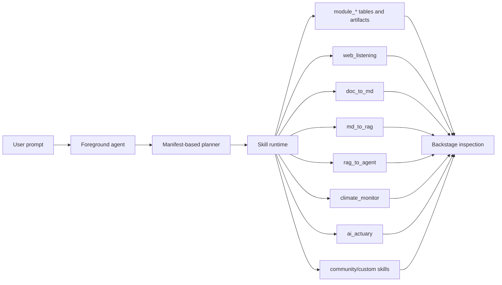

# ai_interface

`ai_interface` is the top-level Agent OS console for composing AI skills and tools into inspectable workflows. The foreground is the user-facing agent experience; Backstage is the development and operations surface where each skill's manifest, runtime I/O, events, artifacts, readiness, and optional HTML UI can be inspected.

The current runtime wires a generic skill runtime around YAML manifests loaded from
`skills/builtin`, `skills/community`, and `skills/custom`:

| Skill | Source | Project mapping | Role |
|---|---|---|
| `web_listening` | builtin | `../web_listening` | Monitor pages, capture snapshots, extract text, and detect changes. |
| `doc_to_md` | builtin | `../doc_to_md` | Convert source documents into Markdown, assets, warnings, and trace data. |
| `md_to_rag` | builtin | `../c-ross-2` | Chunk Markdown and prepare RAG-ready records. |
| `rag_to_agent` | builtin | `../c-ross-2` | Generate agent prompts, tool bindings, configs, and validation output. |
| `climate_monitor` | builtin | `../climate_monitor_wiki` | Run the climate monitor workflow and summarize report/source/scope coverage. |
| `ai_actuary` | builtin | `../ai_actuary` | Invoke the ai_actuary reserving pipeline through the safe CLI executor. |
| `example_reporter` | community | `skills/community/example_reporter` | Validation-only community manifest example. |

This repository only edits and owns the `ai_interface` side. Sibling projects are referenced through manifest metadata and readiness checks; their code, secrets, and local `.env` files are not copied or modified by this app.

## Agent OS Overview



The runtime preserves the existing module-run database/API compatibility while promoting the vocabulary to skills:

- `moduleId` remains accepted and returned for existing routes and stored data.
- `skillId` is now included in Agent plans and skill metadata.
- `/api/skills` returns skill manifests plus redacted readiness.
- Planner output is normalized against enabled skill manifests, unknown skills are ignored with warnings, and registered custom skill manifests can participate in a run.

## Planner Providers

Agent planning goes through a provider registry. OpenAI remains the default
configured planner and uses `OPENAI_API_KEY` with the Responses API. Anthropic
uses `ANTHROPIC_API_KEY`, Ollama uses `OLLAMA_API_BASE_URL`, and the
deterministic planner is an explicit no-env fallback.

Provider readiness is reported as metadata only: provider names, required env
var names, missing env var names, default model IDs, and whether reasoning
effort is supported. The API does not return API key values or local Ollama
base URLs. If the selected provider is not ready, the runtime chooses the first
ready provider in fallback order (`openai`, `anthropic`, `ollama`) and otherwise
uses the deterministic planner with a warning.

Before saving non-OpenAI providers in an existing Postgres database, apply the
checked-in enum migration:

```bash
psql "$DATABASE_URL" -f lib/db/migrations/20260520_add_agent_provider_values.sql
```

The migration is idempotent and only adds `anthropic`, `ollama`, and
`deterministic` to the existing `agent_provider` enum.

## Plan Execution Modes

Agent plans default to `mode: "linear"`. Linear mode preserves the existing
behavior: module runs are created in planner order, `execute_ready` walks them
in that same order, and dependency metadata is not required.

Planners may opt into `mode: "dag"` when steps can be safely orchestrated by
dependency. DAG steps must provide stable `stepId` values, and every
`dependsOn` value must reference another step in the same plan. The runtime
validates missing step IDs, duplicate step IDs, unknown dependencies, and
cycles before creating module runs.

In DAG `execute_ready`, dependency-ready non-approval steps run in parallel
batches. The default concurrency cap is 8 ready steps; set
`AI_INTERFACE_DAG_MAX_CONCURRENCY` to a positive integer to lower or raise that
limit for local operations. Approval-required upstream steps remain pending with
`adapterExecutionStatus: "approval_required"` and block downstream dependents
with `dagExecutionStatus: "blocked"` metadata plus an
`agent.plan.step.blocked` event. Failed upstream steps use
`failureStrategy: "fail_fast"` by default; planners can request
`"continue_independent"` to let branches that do not depend on the failed step
keep running.

## Foreground vs Backstage

Foreground is for the normal Agent conversation and workflow progress:

- submit a request to the Agent;
- see ordered skill steps;
- inspect high-level progress, results, data, and sources;
- keep user approval and feedback in the user-facing flow.

Backstage is the Replit-style operations surface:

- browse the skill catalog;
- inspect each manifest, external project mapping, adapter readiness, UI capability, input/output schemas, and raw JSON;
- view run I/O, events, and artifacts;
- open a skill-provided HTML UI in a sandboxed iframe when `ui.htmlEntrypoint` exists;
- fall back to generic renderers when a skill has no HTML UI.

## Skill Manifest Contract

Skill manifests describe what the Agent can plan and how the UI should display a skill:

```ts
interface SkillManifest {
  skillId: string;
  moduleId: string;
  name: string;
  description: string;
  category: "source" | "transform" | "index" | "agent";
  project: {
    source: "builtin" | "community" | "custom" | "external";
    defaultSiblingPath: string;
    envPath?: string;
    repoUrl?: string;
    packageName?: string;
  };
  execution: {
    kind: "http" | "cli" | "internal" | "mcp";
    adapterId: string;
    requiredEnv: string[];
    optionalEnv: string[];
    timeoutMs: number;
    maxOutputBytes: number;
    allowedCommands: string[];
    supportsResume: boolean;
    readinessHint?: string;
    mcpServerEnv?: string;
    mcpToolName?: string;
  };
  inputSchema: Record<string, unknown>;
  outputSchema: Record<string, unknown>;
  interactionKinds: Array<"question" | "approval" | "data_request" | "blocked">;
  artifactKinds: string[];
  ui: {
    mode: "html" | "renderer" | "auto";
    htmlEntrypoint?: string;
    openOnTrigger: boolean;
    preferredRenderer: "markdown" | "table" | "json" | "text" | "image" | "file";
  };
  permissions: {
    approvalRequired: boolean;
    canUseNetwork: boolean;
    canWriteDatabase: boolean;
  };
}
```

Built-in manifests live in `skills/builtin/<skillId>/skill.yaml`. Reviewed,
repository-managed community manifests live in
`skills/community/<skillId>/skill.yaml`. Local developer experiments live in
`skills/custom/<skillId>/skill.yaml`; that directory is ignored except for its
`.gitkeep`.

The API server loads roots in this order by default:

1. `skills/builtin`
2. `skills/community`
3. `skills/custom`

Override policy is intentionally narrow:

- community skills cannot override built-in skills;
- custom skills can override community skills for local testing;
- custom skills cannot override built-in skills unless
  `AI_INTERFACE_ALLOW_BUILTIN_SKILL_OVERRIDE=1` is set.

The loader validates YAML, applies documented defaults for omitted UI,
execution, permissions, interaction, and artifact fields, and keeps runtime
ordering deterministic for existing API behavior.

`GET /api/skills` reports readiness without exposing secret values or configured local paths. It returns env var names and default sibling path metadata only.

To validate manifests without starting the API server:

```bash
corepack pnpm run skill:validate
```

The command prints a redacted JSON summary with skill IDs, source metadata, env
var names, and readiness states. It does not print env values or configured
absolute local paths.

Real tool execution is disabled unless
`AI_INTERFACE_TOOL_EXECUTION_MODE=real` is set. CLI, HTTP, and MCP adapters all
run through bounded executor paths with timeout and output-size limits. MCP
skills must declare `execution.mcpServerEnv` and `execution.mcpToolName`; the
server URL is read from the named env var at execution time and is not exposed
through readiness, events, or results.

Community contributor workflow:

1. Create `skills/community/<skillId>/skill.yaml`.
2. Run `corepack pnpm run skill:validate`.
3. Run `corepack pnpm --filter @workspace/api-server run test`.
4. Open a PR.

## Repository Structure

```text
.
├── artifacts/
│   ├── api-server/        # Express API, agent runtime, module ingest, skill runtime
│   └── mockup-sandbox/    # React/Vite Agent OS interface
├── lib/
│   ├── api-spec/          # OpenAPI source of truth
│   ├── api-client-react/  # Generated React Query client
│   ├── api-zod/           # Generated Zod schemas/types
│   └── db/                # Drizzle schema and database client
├── docs/
│   └── superpowers/plans/ # PR implementation plans
└── scripts/
```

For a browser-friendly project introduction and usage guide, open
`docs/project-overview.html` directly in a browser.

## Built-in Projects

Default project path detection is intentionally shallow:

- `web_listening` checks `WEB_LISTENING_PROJECT_PATH` or `../web_listening`;
- `doc_to_md` checks `DOC_TO_MD_PROJECT_PATH` or `../doc_to_md`;
- `md_to_rag` checks `CROSS2_PROJECT_PATH` or `../c-ross-2`;
- `rag_to_agent` checks `CROSS2_PROJECT_PATH` or `../c-ross-2`.
- `climate_monitor` checks `CLIMATE_MONITOR_PROJECT_PATH` or `../climate_monitor_wiki`.
- `ai_actuary` checks `AI_ACTUARY_PROJECT_PATH` or `../ai_actuary`.
- `example_reporter` is a community validation fixture under `skills/community/example_reporter` and is disabled unless `EXAMPLE_REPORTER_ENABLED` is set.

Readiness is a local existence check only. Real sibling project commands only
run through the opt-in safe executor path when
`AI_INTERFACE_TOOL_EXECUTION_MODE=real` is set and the manifest allowlist
matches the requested command.

## Development

Install dependencies:

```bash
corepack pnpm install
```

Run the API server:

```bash
corepack pnpm --filter @workspace/api-server run dev
```

Run the Agent OS interface on port 8080:

```powershell
$env:PORT='8080'
$env:BASE_PATH='/'
$env:VITE_DEFAULT_PREVIEW='ai-os/AgentFirstInterface'
corepack pnpm --dir artifacts/mockup-sandbox run dev
```

Regenerate API clients after editing `lib/api-spec/openapi.yaml`:

```bash
corepack pnpm --filter @workspace/api-spec run codegen
```

## Verification

Recommended checks for this project:

```bash
corepack pnpm --filter @workspace/api-server run test
corepack pnpm --filter @workspace/api-server run build
corepack pnpm --filter @workspace/api-spec run codegen
corepack pnpm run typecheck:libs
corepack pnpm --dir artifacts/mockup-sandbox run typecheck
```

Windows build smoke for the current UI:

```powershell
$env:PORT='8080'
$env:BASE_PATH='/'
$env:VITE_DEFAULT_PREVIEW='ai-os/AgentFirstInterface'
corepack pnpm --dir artifacts/mockup-sandbox run build
git diff --check
```

Browser smoke should verify:

- Foreground renders and can submit/show a flow;
- Backstage is switchable from the top bar;
- the skill catalog shows the default built-in and community skills;
- selected skill detail shows manifest, readiness, I/O, events, artifacts, and raw JSON;
- skills with `htmlEntrypoint` show a sandboxed Skill UI tab;
- trigger/approval runs select the corresponding Backstage Skill UI tab.

## Security

Skill and planner readiness are redacted by design. The API reports missing/configured env var names but not values, and it does not expose configured local path, local provider URL, MCP server URL, auth token, or raw header values. Real adapter execution remains opt-in through the safe executor path; default local planning still uses the deterministic provider when no configured model provider is ready.

## License

MIT
