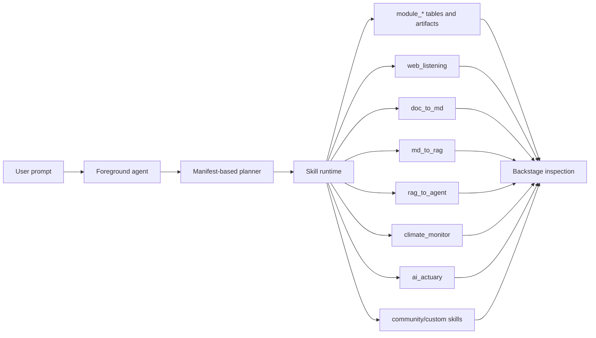

# ai_interface

[中文文档](README_zh.md)

`ai_interface` is an AI Team Mission Control console. Normal users start in Mission Center, describe a goal, review the generated mission plan, approve high-risk actions, and decide when execution should begin. Advanced users can then move into Backstage and Operator surfaces to inspect manifests, runtime I/O, events, artifacts, readiness, approvals, and guarded configuration changes.

Mission-first is the product default:

- **Mission Center** is the default normal-user path for intake, plan review, approval, and execution handoff.
- **Backstage** is the execution and inspection workbench for Agents, Skills, Runs, and Artifacts.
- **Operator Backstage** is the advanced governance path for manifest review, read-only inspection, and guarded custom-manifest mutation.

The current runtime wires a generic skill runtime around YAML manifests loaded from
`skills/builtin`, `skills/community`, and `skills/custom`:

| Skill | Source | Project mapping | Role |
|---|---|---|---|
| `web_listening` | builtin | `../web_listening` | Monitor pages, capture snapshots, extract text, and detect changes. |
| `doc_to_md` | builtin | `../doc_to_md` | Convert source documents into Markdown, assets, warnings, and trace data. |
| `md_to_rag` | builtin | `../c-ross-2` | Chunk Markdown and prepare RAG-ready records. |
| `rag_to_agent` | builtin | `../c-ross-2` | Generate agent prompts, tool bindings, configs, and validation output. |
| `climate_monitor` | builtin | `../climate_monitor_wiki` | Run the climate monitor workflow and summarize report/source/scope coverage. |
| `ai_actuary` | builtin | `../ai_actuary` | Invoke the ai_actuary reserving pipeline through the safe CLI executor. |
| `example_reporter` | community | `skills/community/example_reporter` | Validation-only community manifest example. |

**Design principle:** approval and execution are decoupled — `approve` confirms the plan/revision and execution readiness, while `execute` is an explicit separate call that creates runtime runs. The runtime, API, database, and logs remain the system of record; documentation describes collaboration boundaries without duplicating runtime state.

This repository only edits and owns the `ai_interface` side. Sibling projects are referenced through manifest metadata and readiness checks; their code, secrets, and local `.env` files are not copied or modified by this app.

---

## Agent Manifest (九段式 Agent 定义)

Each agent is defined by a YAML manifest with nine major sections that form a complete digital expert definition — going beyond skill binding to capture identity, operating rules, deliverables, workflow, communication style, and success metrics:

```yaml
agentId: knowledge_builder
name: Knowledge Builder
description: ...
source: builtin|community|custom
runtimeStatus: active|template       # template = not yet ready to run

# ── 九段 ──
identity:                            # Who the agent is
  persona: ...
  background: ...

criticalRules:                       # Must-follow constraints
  - id: ...
    description: ...
    severity: blocker|warning

deliverables:                        # What the agent produces
  - name: ...
    format: YAML|PDF|Markdown|...
    successCriteria: ...

workflow:                            # How the agent works
  - name: ...
    approvalRequired: true|false
    deliverables: [...]

communicationStyle:                  # How the agent communicates
  tone: ...
  outputFormat: ...
  languagePreference: zh-CN|en

successMetrics:                      # How success is measured
  - metric: ...
    target: ...
    measurement: ...

# ── Operational ──
teamId: insurance|knowledge          # Division / team assignment
skills: [...]                        # Bound skill references
planner: { mode: linear|dag, ... }
permissions: { ... }
memory: { promotionMode: ... }
handoffs: [...]
tests: [...]                         # Manifest-level smoke tests
```

### Built-in Agents

| Agent ID | Name | Team | Runtime Status | Description |
|---|---|---|---|---|
| `knowledge_builder` | Knowledge Builder | knowledge | active | Full pipeline: web_listening → doc_to_md → md_to_rag → rag_to_agent |
| `evidence_collector` | Evidence Collector | — | active | 轻量级证据采集 Agent，绑定 web_listening 和 doc_to_md |

### Template Agents (寿险行业)

Four template agents (`runtimeStatus: template`) under `agents/custom/` demonstrate life-insurance-domain agent design. They carry complete nine-section manifests but have empty skill bindings — ready to be wired to real adapters:

| Agent ID | Name | Role |
|---|---|---|
| `claims_reviewer` | 理赔审核师 | 寿险理赔审核专家，核查理赔申请的合规性和真实性 |
| `compliance_auditor` | 合规审计师 | 寿险合规审计专家，确保业务流程符合监管要求 |
| `life_uw_analyst` | 核保分析师 | 寿险核保分析专家，评估投保申请的风险等级 |
| `pricing_actuary` | 定价精算师 | 寿险定价精算专家，计算保险费率和准备金 |

### Agent Interop Exports

- `GET /api/agents/:agentId/export/vscode-agent` returns a VS Code-compatible `.agent.md` file with YAML front matter plus the agent instructions as the Markdown body.
- `GET /api/agents/:agentId/export/mcp-tool` returns redacted MCP wrapper metadata with a deterministic `run_<agentId>` tool name and an input schema.

Unknown agent IDs return 404, and export payloads redact secret-looking local values.

---

## Teams & Divisions

Agents are organized into divisions via `teamId`. Teams are registered in `teams/team-registry.yaml`:

```yaml
teams:
  insurance:
    displayName: 寿险业务
    description: 寿险精算、核保、理赔、合规
    industries:
      - life_insurance
  knowledge:
    displayName: 知识工程
    description: 文档处理、知识库构建
```

`GET /api/teams` returns team definitions. `GET /api/agents?teamId=insurance` filters agents by team.

---

## Mission Plan, QA Gate & Activation Profile

Mission plans support structured quality gates and risk-level activation profiles:

**QA Steps** (`missionPlanStep` with evidence contract):
- Each step can declare an optional `qaStepId` referencing a dedicated QA step.
- QA steps carry an `evidenceContract` specifying what assertions must pass (`assertionType: equals|contains|matches|exists`) and the expected values.
- Steps with `stepRole: qa` gate downstream execution — non-QA steps downstream of a QA step remain blocked until the QA step passes.

**Activation Profile** (`missionPlanActivationProfile`):
- `level`: `none` | `low` | `medium` | `high` — controls the review intensity.
- `reviewIntensity`: `none` | `light` | `standard` | `deep` — how many QA gates and evidence checks are injected.
- Profiles with `level: high` or `reviewIntensity: deep` add extra gating steps automatically.

---

## API Summary

### Agents
- `GET /api/agents` — list all agents (supports `?teamId=` filter)
- `GET /api/agents/:agentId` — single agent manifest
- `GET /api/agents/:agentId/export/vscode-agent` — VS Code export
- `GET /api/agents/:agentId/export/mcp-tool` — MCP export

### Teams
- `GET /api/teams` — list registered teams

### Skills
- `GET /api/skills` — list skills with redacted readiness

### Runs
- `POST /api/agent-runs` — create a run (optional `agentId`)
- `GET /api/runs` — list runs (filterable by `agentId`, `skillId`, `moduleId`, `status`, `limit`)
- `GET /api/runs/:pipelineRunId/timeline` — timeline with messages, status, modules, events

### Artifacts
- `GET /api/artifacts` — list artifacts (filterable by `pipelineRunId`, `moduleRunId`, `kind`, `limit`)

### Missions
- `POST /api/missions` — create mission
- `POST /api/missions/:missionId/approve` — approve without executing
- `POST /api/missions/:missionId/execute` — explicit execution

All inspection responses redact configured env values, provider keys, local provider URLs, MCP server URLs, token-like fields, and configured absolute local paths.

---

## Agent OS Architecture



---

## Planner Providers

Agent planning goes through a provider registry. OpenAI remains the default
configured planner and uses `OPENAI_API_KEY` with the Responses API. Anthropic
uses `ANTHROPIC_API_KEY`, Ollama uses `OLLAMA_API_BASE_URL`, and the
deterministic planner is an explicit no-env fallback.

Provider readiness is reported as metadata only: provider names, required env
var names, missing env var names, default model IDs, and whether reasoning
effort is supported. The API does not return API key values or local Ollama
base URLs. If the selected provider is not ready, the runtime chooses the first
ready provider in fallback order (`openai`, `anthropic`, `ollama`) and otherwise
uses the deterministic planner with a warning.

Before saving non-OpenAI providers in an existing Postgres database, apply the
checked-in enum migration:

```bash
psql "$DATABASE_URL" -f lib/db/migrations/20260520_add_agent_provider_values.sql
```

The migration is idempotent and only adds `anthropic`, `ollama`, and
`deterministic` to the existing `agent_provider` enum.

---

## Plan Execution Modes

Agent plans default to `mode: "linear"`. Linear mode preserves the existing
behavior: module runs are created in planner order, `execute_ready` walks them
in that same order, and dependency metadata is not required.

Planners may opt into `mode: "dag"` when steps can be safely orchestrated by
dependency. DAG steps must provide stable `stepId` values, and every
`dependsOn` value must reference another step in the same plan. The runtime
validates missing step IDs, duplicate step IDs, unknown dependencies, and
cycles before creating module runs.

In DAG `execute_ready`, dependency-ready non-approval steps run in parallel
batches. The default concurrency cap is 8 ready steps; set
`AI_INTERFACE_DAG_MAX_CONCURRENCY` to a positive integer to lower or raise that
limit for local operations. Approval-required upstream steps remain pending with
`adapterExecutionStatus: "approval_required"` and block downstream dependents
with `dagExecutionStatus: "blocked"` metadata plus an
`agent.plan.step.blocked` event. Failed upstream steps use
`failureStrategy: "fail_fast"` by default; planners can request
`"continue_independent"` to let branches that do not depend on the failed step
keep running.

---

## Mission Center, Backstage, and Operator

Mission Center is the default normal-user path:

- submit a mission request in product language rather than raw skill terms;
- review the generated mission plan, dependencies, and approval gates;
- approve without automatically executing;
- decide whether to keep the plan staged or call `/api/missions/:missionId/execute`.

Backstage is the execution and inspection workbench:

- browse Agents, Skills, Runs, and Artifacts as first-class tabs;
- inspect agent manifests with full nine-section detail (identity, criticalRules, deliverables, workflow, communicationStyle, successMetrics);
- view team assignment (`teamId`) and filter agents by team;
- see runtimeStatus indicators (active / template);
- inspect skill manifests, adapter readiness, run I/O, events, artifacts, and Skill UI handoff.

Operator Backstage is the advanced path:

- review built-in, community, and custom manifests with source labeling;
- keep secret-like values, local paths, provider URLs, tokens, and MCP-style endpoints redacted in API/UI responses;
- allow only guarded localhost custom-manifest mutation while built-in/community manifests remain read-only.

---

## Skill Manifest Contract

Skill manifests describe what the Agent can plan and how the UI should display a skill:

```ts
interface SkillManifest {
  skillId: string;
  moduleId: string;
  name: string;
  description: string;
  category: "source" | "transform" | "index" | "agent";
  project: {
    source: "builtin" | "community" | "custom" | "external";
    defaultSiblingPath: string;
    envPath?: string;
    repoUrl?: string;
    packageName?: string;
    readiness?: {
      requiredPaths: string[];
    };
  };
  execution: {
    kind: "http" | "cli" | "internal" | "mcp";
    adapterId: string;
    requiredEnv: string[];
    optionalEnv: string[];
    timeoutMs: number;
    maxOutputBytes: number;
    allowedCommands: string[];
    supportsResume: boolean;
    readinessHint?: string;
    mcpServerEnv?: string;
    mcpToolName?: string;
  };
  inputSchema: Record<string, unknown>;
  outputSchema: Record<string, unknown>;
  interactionKinds: Array<"question" | "approval" | "data_request" | "blocked">;
  artifactKinds: string[];
  ui: {
    mode: "html" | "renderer" | "auto";
    htmlEntrypoint?: string;
    openOnTrigger: boolean;
    preferredRenderer: "markdown" | "table" | "json" | "text" | "image" | "file";
  };
  permissions: {
    approvalRequired: boolean;
    canUseNetwork: boolean;
    canWriteDatabase: boolean;
  };
}
```

Built-in manifests live in `skills/builtin/<skillId>/skill.yaml`. Reviewed,
repository-managed community manifests live in
`skills/community/<skillId>/skill.yaml`. Local developer experiments live in
`skills/custom/<skillId>/skill.yaml`; that directory is ignored except for its
`.gitkeep`.

The API server loads roots in this order by default:

1. `skills/builtin`
2. `skills/community`
3. `skills/custom`

Override policy is intentionally narrow:

- community skills cannot override built-in skills;
- custom skills can override community skills for local testing;
- custom skills cannot override built-in skills unless
  `AI_INTERFACE_ALLOW_BUILTIN_SKILL_OVERRIDE=1` is set.

The loader validates YAML, applies documented defaults for omitted UI,
execution, permissions, interaction, and artifact fields, and keeps runtime
ordering deterministic for existing API behavior.

`project.readiness.requiredPaths` is optional. When omitted or empty, project
readiness and adapter sibling fallback check that the project root exists. When
present, each path must be relative to the project root and cannot contain `..`
traversal segments; readiness and fallback then require the project root and
those project-relative files to exist. The fallback only satisfies the manifest
project env path, such as `CLIMATE_MONITOR_PROJECT_PATH`, and does not satisfy
unrelated required env vars such as CLI binary paths.

`GET /api/skills` reports readiness without exposing secret values or configured local paths. It returns env var names and default sibling path metadata only.

To validate manifests without starting the API server:

```bash
corepack pnpm run skill:validate
```

The command prints a redacted JSON summary with skill IDs, source metadata, env
var names, and readiness states. It does not print env values or configured
absolute local paths.

---

## Agent Manifest CLI

To validate agent manifests without starting the API server:

```bash
corepack pnpm run agent:validate
```

The command prints a redacted JSON summary with agent IDs, sources, skill IDs,
missing skill IDs, planner defaults, permissions, memory policy, and an `ok`
boolean.

Local custom agents can be generated without hand-editing YAML:

```bash
corepack pnpm run agent:create -- --agent-id my_agent --name "My Agent" --skills doc_to_md,md_to_rag
```

The generator and optional `POST /api/agent-manifests` write only to
`agents/custom/<agentId>/agent.yaml`. The API write route returns 403 unless
`AI_INTERFACE_MANIFEST_WRITE_MODE=custom` is set. VS Code `.agent.md` files can
be imported with:

```bash
corepack pnpm run agent:import-vscode -- --agent-id imported_agent --name "Imported Agent" --file ./agent.agent.md
```

Only tool or skill names matching registered `skillId` values become bindings,
and unmatched names are reported as warnings.

Real tool execution is disabled unless
`AI_INTERFACE_TOOL_EXECUTION_MODE=real` is set. CLI, HTTP, and MCP adapters all
run through bounded executor paths with timeout and output-size limits. MCP
skills must declare `execution.mcpServerEnv` and `execution.mcpToolName`; the
server URL is read from the named env var at execution time and is not exposed
through readiness, events, or results.

Community contributor workflow:

1. Create `skills/community/<skillId>/skill.yaml`.
2. Run `corepack pnpm run skill:validate`.
3. Run `corepack pnpm --filter @workspace/api-server run test`.
4. Open a PR.

For a complete community skill manifest template, see
`skills/community/README.md`.

---

## Repository Structure

```text
.
├── artifacts/
│   ├── api-server/        # Express API, agent runtime, module ingest, skill runtime
│   └── mockup-sandbox/    # React/Vite Agent OS interface
├── agents/
│   ├── builtin/           # Built-in agent manifests (knowledge_builder, evidence_collector)
│   ├── community/         # Community agent manifests
│   └── custom/            # Template agents (life insurance) and local experiments
├── skills/
│   ├── builtin/           # Built-in skill manifests
│   ├── community/         # Community skill manifests
│   └── custom/            # Local skill experiments (gitignored except .gitkeep)
├── teams/
│   └── team-registry.yaml # Division / team definitions
├── lib/
│   ├── api-spec/          # OpenAPI source of truth
│   ├── api-client-react/  # Generated React Query client
│   ├── api-zod/           # Generated Zod schemas/types
│   └── db/                # Drizzle schema and database client
├── docs/
│   ├── contracts/fixtures/ # Compatibility reference payloads
│   ├── demos/             # Mission walkthrough docs
│   └── project-overview.html
└── scripts/
    └── src/               # CLI tools: validate, create, import agents/skills
```

For a browser-friendly project introduction and usage guide, open
`docs/project-overview.html` directly in a browser.

---

## Built-in Projects

Default project path detection is intentionally shallow:

- `web_listening` checks `WEB_LISTENING_PROJECT_PATH` or `../web_listening`;
- `doc_to_md` checks `DOC_TO_MD_PROJECT_PATH` or `../doc_to_md`;
- `md_to_rag` checks `CROSS2_PROJECT_PATH` or `../c-ross-2`;
- `rag_to_agent` checks `CROSS2_PROJECT_PATH` or `../c-ross-2`.
- `climate_monitor` checks `CLIMATE_MONITOR_PROJECT_PATH` or `../climate_monitor_wiki`.
- `ai_actuary` checks `AI_ACTUARY_PROJECT_PATH` or `../ai_actuary`.
- `example_reporter` is a community validation fixture under `skills/community/example_reporter` and is disabled unless `EXAMPLE_REPORTER_ENABLED` is set.

`climate_monitor` additionally requires `scripts/run_climate_monitor.py`, and
`ai_actuary` additionally requires `scripts/run_tool_pipeline.py`; both
requirements are declared in their skill manifests under
`project.readiness.requiredPaths`.

Readiness is local existence checking only. Real sibling project commands only
run through the opt-in safe executor path when
`AI_INTERFACE_TOOL_EXECUTION_MODE=real` is set and the manifest allowlist
matches the requested command.

---

## Development

Install dependencies:

```bash
corepack pnpm install
```

Run the API server:

```bash
corepack pnpm --filter @workspace/api-server run dev
```

Run the Agent OS interface on port 8080:

```bash
PORT=8080 BASE_PATH=/ VITE_DEFAULT_PREVIEW=ai-os/AgentFirstInterface \
  corepack pnpm --dir artifacts/mockup-sandbox run dev
```

Regenerate API clients after editing `lib/api-spec/openapi.yaml`:

```bash
corepack pnpm --filter @workspace/api-spec run codegen
```

---

## Verification

Recommended checks for this project:

```bash
corepack pnpm --filter @workspace/api-server run test
corepack pnpm --filter @workspace/api-server run build
corepack pnpm --filter @workspace/api-spec run codegen
corepack pnpm run typecheck:libs
corepack pnpm --dir artifacts/mockup-sandbox run typecheck
```

Build smoke for the current UI:

```bash
PORT=8080 BASE_PATH=/ VITE_DEFAULT_PREVIEW=ai-os/AgentFirstInterface \
  corepack pnpm --dir artifacts/mockup-sandbox run build
git diff --check
```

Browser smoke should verify:

- Foreground renders and can submit/show a flow;
- Backstage is switchable from the top bar;
- the Agents tab renders all 6 agents with nine-section detail and team filtering;
- the Skills tab still shows the default built-in and community skills;
- the Runs tab shows ordered module steps, events, active skill, and raw JSON;
- the Artifacts tab groups artifacts by pipeline and module run;
- selected skill detail shows manifest, readiness, I/O, events, artifacts, and raw JSON;
- skills with `htmlEntrypoint` show a sandboxed Skill UI tab;
- trigger/approval runs select the corresponding Backstage Skill UI tab.

---

## Security

Skill and planner readiness are redacted by design. The API reports missing/configured env var names but not values, and it does not expose configured local path, local provider URL, MCP server URL, auth token, or raw header values. Real adapter execution remains opt-in through the safe executor path; default local planning still uses the deterministic provider when no configured model provider is ready.

---

## License

MIT
