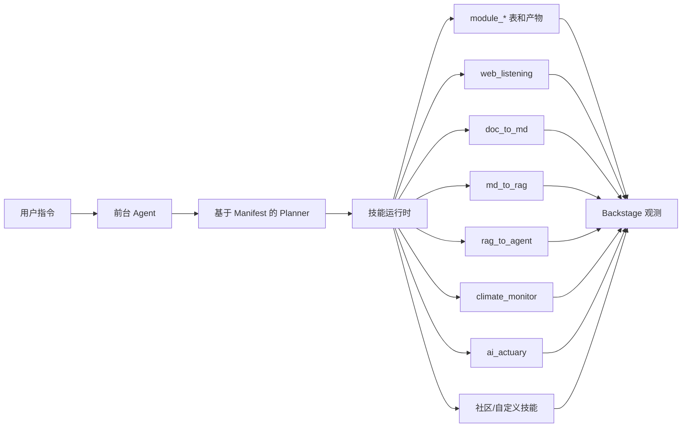

# ai_interface

[English](README.md)

`ai_interface` 是一个 AI Team 任务控制台（Mission Control）。普通用户在 Mission Center 中提交任务目标、审核生成的执行计划、确认高风险动作，并自主决定何时开始执行。高级用户可以进入 Backstage 和 Operator 界面查看 manifest、运行时 I/O、事件、产物、就绪状态、审批和受保护的配置变更。

**产品默认以 Mission 为先：**

- **Mission Center** — 普通用户的默认入口，用于任务提交、计划审核、审批和执行交接。
- **Backstage** — 执行与观测工作台，提供 Agents、Skills、Runs、Artifacts 四大标签页。
- **Operator Backstage** — 高级治理入口，用于 manifest 审核、只读检查以及受保护的自定义 manifest 变更。

---

## 设计原则

**审批与执行解耦：**`approve` 仅确认计划和执行就绪状态，`execute` 是独立的显式调用，负责创建运行时记录。系统事实源始终以 runtime、API、数据库和日志为准，文档仅描述协作边界，不复制运行时状态。

---

## 内置技能

运行时基于 YAML manifest 加载技能，按 `skills/builtin` → `skills/community` → `skills/custom` 顺序：

| 技能 | 来源 | 关联项目 | 功能 |
|---|---|---|---|
| `web_listening` | builtin | `../web_listening` | 页面监控、快照采集、文本提取与变更检测 |
| `doc_to_md` | builtin | `../doc_to_md` | 源文档转 Markdown，附带资源、警告与追踪数据 |
| `md_to_rag` | builtin | `../c-ross-2` | Markdown 分块，准备 RAG 就绪记录 |
| `rag_to_agent` | builtin | `../c-ross-2` | 生成 Agent 提示词、工具绑定、配置与验证 |
| `climate_monitor` | builtin | `../climate_monitor_wiki` | 运行气候监控工作流并汇总报告/来源/覆盖范围 |
| `ai_actuary` | builtin | `../ai_actuary` | 通过安全 CLI 执行器调用精算准备金流水线 |
| `example_reporter` | community | `skills/community/example_reporter` | 仅用于验证的社区 manifest 示例 |

本仓库仅编辑和维护 `ai_interface` 自身。关联项目通过 manifest 元数据和就绪检查引用；不复制、不修改关联项目的代码、密钥和本地 `.env` 文件。

---

## Agent 清单

Agent manifest 同样基于文件加载，从 `agents/builtin`、`agents/community`、`agents/custom` 三个来源读取。首个内置 Agent 是 `knowledge_builder`，绑定了 `web_listening`、`doc_to_md`、`md_to_rag`、`rag_to_agent`，构成可观测的知识构建工作流。

`GET /api/agents` 返回 Agent manifest 及根据已注册技能推断的就绪状态。缺失的技能 ID 以就绪元数据形式报告，不会导致列表接口崩溃。

Agent 互操作导出：

- `GET /api/agents/:agentId/export/vscode-agent` — 返回 VS Code 兼容的 `.agent.md` 文件，包含 YAML front matter 和 Markdown 指令体。
- `GET /api/agents/:agentId/export/mcp-tool` — 返回脱敏的 MCP 包装元数据，提供确定性的 `run_<agentId>` 工具名和输入 schema。

未知 Agent ID 返回 404，导出数据脱敏处理本地敏感值，不暴露 provider 或 MCP 内部信息。

`POST /api/agent-runs` 支持可选的 `agentId`。提供后，运行时会选择该 Agent 的已注册技能、使用其 planner 默认值、仅对当次运行应用 provider 偏好设置，并在新的 thread 记录、消息、pipeline 运行和 module 运行上记录 Agent 元数据。

---

## 运行巡检

运行巡检为只读接口：

- `GET /api/runs` — 可按 `agentId`、`skillId`、`moduleId`、`status`、`limit` 过滤
- `GET /api/runs/:pipelineRunId/timeline` — 返回按时间排序的 thread 消息、pipeline 状态、module 运行和事件
- `GET /api/artifacts` — 可按 `pipelineRunId`、`moduleRunId`、`kind`、`limit` 过滤

所有巡检响应在返回前脱敏处理：环境变量值、provider 密钥、本地 provider URL、MCP 服务器 URL、token 类字段和配置的绝对路径。

---

## Agent OS 架构



---

## Planner 供应者

Agent 规划通过供应者注册表进行。OpenAI 是默认配置的 planner，使用 `OPENAI_API_KEY` 和 Responses API。Anthropic 使用 `ANTHROPIC_API_KEY`，Ollama 使用 `OLLAMA_API_BASE_URL`，确定性 planner 是显式的无环境变量回退方案。

就绪状态仅以元数据形式报告：供应者名称、所需环境变量名、缺失的环境变量名、默认模型 ID、是否支持推理强度。API 不返回 API 密钥值或本地 Ollama 基础 URL。若选定供应者不可用，运行时按回退顺序（`openai` → `anthropic` → `ollama`）选择第一个可用供应者，否则使用确定性 planner 并发出警告。

在已有 Postgres 数据库中保存非 OpenAI 供应者前，需执行迁移：

```bash
psql "$DATABASE_URL" -f lib/db/migrations/20260520_add_agent_provider_values.sql
```

---

## 计划执行模式

Agent 计划默认 `mode: "linear"`。线性模式保持现有行为：按 planner 顺序创建 module 运行，`execute_ready` 按相同顺序推进。

Planner 可选择 `mode: "dag"` 以依赖关系编排步骤。DAG 步骤必须提供稳定的 `stepId`，每个 `dependsOn` 必须引用同计划中的另一个步骤。运行时会校验缺失/重复步骤 ID、未知依赖和循环依赖。

DAG 模式下，无审批要求的就绪步骤并行执行（默认最大并发 8，可通过 `AI_INTERFACE_DAG_MAX_CONCURRENCY` 调整）。需要审批的上游步骤保持 `approval_required` 状态并阻塞下游。失败的上游步骤默认 `fail_fast`；可配置 `continue_independent` 让不受影响的并行分支继续运行。

---

## 三条路径

### Mission Center（普通用户默认路径）

- 以产品语言提交任务需求（而非底层技能术语）
- 审核生成的执行计划、依赖与审批关卡
- 批准后不自动执行
- 自主决定保留待执行或调用 `/api/missions/:missionId/execute`

### Backstage（执行与观测工作台）

- 浏览 Agents、Skills、Runs、Artifacts 四大一级标签页
- 检查 Agent manifest、绑定技能、planner 模式、权限、handoff 和自定义 Agent 生成的 YAML
- 发起 Agent 测试运行，API 不可用时回退到本地演示状态
- 检查技能 manifest、适配器就绪状态、运行 I/O、事件、产物和 Skill UI 交接

### Operator Backstage（高级治理路径）

- 审核带来源标签的内置/社区/自定义 manifest
- API/UI 响应脱敏处理密钥值、本地路径、provider/MCP URL 和 token
- 仅允许受保护的 localhost 自定义 manifest 变更，内置和社区 manifest 保持只读

---

## 仓库结构

```text
.
├── artifacts/
│   ├── api-server/        # Express API、Agent 运行时、模块接入、技能运行时
│   └── mockup-sandbox/    # React/Vite Agent OS 界面
├── agents/
│   ├── builtin/           # 内置 Agent 清单
│   ├── community/         # 社区 Agent 清单
│   └── custom/            # 本地开发 Agent 清单
├── skills/
│   ├── builtin/           # 内置技能清单
│   ├── community/         # 社区技能清单
│   └── custom/            # 本地开发技能清单
├── lib/
│   ├── api-spec/          # OpenAPI 规范（唯一事实源）
│   ├── api-client-react/  # 生成的 React Query 客户端
│   ├── api-zod/           # 生成的 Zod schema/类型
│   └── db/                # Drizzle schema 和数据库客户端
├── docs/
│   ├── contracts/fixtures/ # 兼容性参考数据
│   ├── demos/             # 任务演示文档
│   └── project-overview.html
└── scripts/
```

---

## 开发

安装依赖：

```bash
corepack pnpm install
```

启动 API 服务器：

```bash
corepack pnpm --filter @workspace/api-server run dev
```

在 8080 端口启动 Agent OS 界面：

```bash
PORT=8080 BASE_PATH=/ VITE_DEFAULT_PREVIEW=ai-os/AgentFirstInterface \
  corepack pnpm --dir artifacts/mockup-sandbox run dev
```

修改 `lib/api-spec/openapi.yaml` 后重新生成 API 客户端：

```bash
corepack pnpm --filter @workspace/api-spec run codegen
```

---

## 验证

推荐检查项：

```bash
corepack pnpm --filter @workspace/api-server run test
corepack pnpm --filter @workspace/api-server run build
corepack pnpm --filter @workspace/api-spec run codegen
corepack pnpm run typecheck:libs
corepack pnpm --dir artifacts/mockup-sandbox run typecheck
```

构建验证：

```bash
PORT=8080 BASE_PATH=/ VITE_DEFAULT_PREVIEW=ai-os/AgentFirstInterface \
  corepack pnpm --dir artifacts/mockup-sandbox run build
git diff --check
```

浏览器验证要点：

- 前台可渲染并提交/展示流程
- 可从顶栏切换至 Backstage
- Agents 标签页渲染 Knowledge Builder 及自定义 Agent YAML 预览
- Skills 标签页显示默认内置和社区技能
- Runs 标签页显示有序的模块步骤、事件和活跃技能
- Artifacts 标签页按 pipeline 和 module 运行分组
- 选中技能详情显示 manifest、就绪状态、I/O、事件、产物
- 带 `htmlEntrypoint` 的技能显示沙箱化 Skill UI 标签页
- 触发/审批运行选中对应的 Backstage Skill UI 标签页

---

## 安全

技能和 planner 就绪状态默认脱敏。API 报告所需/已配置环境变量的名称而非值，不暴露配置的本地路径、本地 provider URL、MCP 服务器 URL、auth token 或原始 header 值。真实适配器执行仍通过安全执行路径选择性开启；无可用的模型供应者时，默认本地规划使用确定性供应者。

---

## 许可证

MIT
