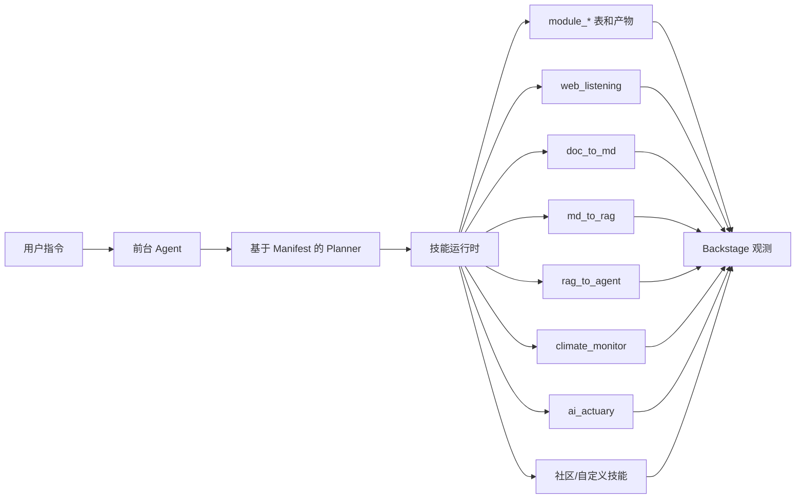

# ai_interface

[English](README.md)

`ai_interface` 是一个 AI Team 任务控制台（Mission Control）。普通用户在 Mission Center 中提交任务目标、审核生成的执行计划、确认高风险动作，并自主决定何时开始执行。公开/token 用户进入同一个 Mission Portal 前台的 token 模式；运营人员使用唯一的 Backstage 工作区查看运行证据、审批、设置和受保护治理能力。

**产品默认以 Mission 为先：**

- **Mission Center / Mission Portal** — 唯一前台路径，用于任务提交、计划审核、当前 Mission 审批、状态和结果交接。
- **Token Mission Portal** — 复用同一前台并走 portal-runtime guard；不暴露 Backstage、manifest、provider/model 设置或 publish token。
- **Backstage** — 唯一后台工作区，承载 Runs、Artifacts、Agents、Skills、Teams、Approvals、Settings。

---

## 设计原则

**审批与执行解耦：**`approve` 仅确认计划和执行就绪状态，`execute` 是独立的显式调用，负责创建运行时记录。系统事实源始终以 runtime、API、数据库和日志为准，文档仅描述协作边界，不复制运行时状态。

---

## 内置技能

运行时基于 YAML manifest 加载技能，按 `skills/builtin` → `skills/community` → `skills/custom` 顺序：

| 技能 | 来源 | 关联项目 | 功能 |
|---|---|---|---|
| `web_listening` | builtin | `../web_listening` | 页面监控、快照采集、文本提取与变更检测 |
| `doc_to_md` | builtin | `../doc_to_md` | 源文档转 Markdown，附带资源、警告与追踪数据 |
| `md_to_rag` | builtin | `../c-ross-2` | Markdown 分块，准备 RAG 就绪记录 |
| `rag_to_agent` | builtin | `../c-ross-2` | 生成 Agent 提示词、工具绑定、配置与验证 |
| `climate_monitor` | builtin | `../climate_monitor_wiki` | 运行气候监控工作流并汇总报告/来源/覆盖范围 |
| `ai_actuary` | builtin | `../ai_actuary` | 通过安全 CLI 执行器调用精算准备金流水线 |
| `example_reporter` | community | `skills/community/example_reporter` | 仅用于验证的社区 manifest 示例 |

本仓库仅编辑和维护 `ai_interface` 自身。关联项目通过 manifest 元数据和就绪检查引用；不复制、不修改关联项目的代码、密钥和本地 `.env` 文件。

---

## Agent Manifest（九段式 Agent 定义）

每个 Agent 通过 YAML manifest 定义，包含九大核心段落，构成完整的数字化专家定义——超越技能绑定，覆盖身份、操作规则、交付物、工作流、沟通风格和成功指标：

```yaml
agentId: knowledge_builder
name: Knowledge Builder
description: ...
source: builtin|community|custom
runtimeStatus: runnable|template     # template=尚未就绪运行

# ── 九段 ──
identity:                            # 身份定义
  persona: ...                       # 角色人设
  background: ...                    # 背景经验

criticalRules:                       # 必须遵守的约束
  - id: ...
    description: ...
    severity: blocker|warning

deliverables:                        # 产出物
  - name: ...
    format: YAML|PDF|Markdown|...
    successCriteria: ...

workflow:                            # 工作流程
  - name: ...
    approvalRequired: true|false
    deliverables: [...]

communicationStyle:                  # 沟通风格
  tone: ...
  outputFormat: ...
  languagePreference: zh-CN|en

successMetrics:                      # 成功指标
  - metric: ...
    target: ...
    measurement: ...

# ── 运营配置 ──
teamId: insurance|knowledge          # 所属团队/业务线
skills: [...]                        # 绑定的技能
planner: { mode: linear|dag, ... }
permissions: { ... }
memory: { promotionMode: ... }
handoffs: [...]
tests: [...]                         # Manifest 级冒烟测试
```

### 内置 Agent

| Agent ID | 名称 | 团队 | 运行状态 | 说明 |
|---|---|---|---|---|
| `knowledge_builder` | Knowledge Builder | knowledge | runnable | 全链路：web_listening → doc_to_md → md_to_rag → rag_to_agent |
| `evidence_collector` | Evidence Collector | — | runnable | 轻量级证据采集 Agent，绑定 web_listening 和 doc_to_md |

### 模板 Agent（寿险行业）

`agents/custom/` 下包含 4 个寿险行业模板 Agent（`runtimeStatus: template`），具备完整的九段 manifest 但技能绑定为空——可接入实际适配器后启用：

| Agent ID | 名称 | 角色 |
|---|---|---|
| `claims_reviewer` | 理赔审核师 | 寿险理赔审核专家，核查理赔申请的合规性和真实性 |
| `compliance_auditor` | 合规审计师 | 寿险合规审计专家，确保业务流程符合监管要求 |
| `life_uw_analyst` | 核保分析师 | 寿险核保分析专家，评估投保申请的风险等级 |
| `pricing_actuary` | 定价精算师 | 寿险定价精算专家，计算保险费率和准备金 |

### Agent 互操作导出

- `GET /api/agents/:agentId/export/vscode-agent` — 返回 VS Code 兼容的 `.agent.md` 文件，包含 YAML front matter 和 Markdown 指令体。
- `GET /api/agents/:agentId/export/mcp-tool` — 返回脱敏的 MCP 包装元数据，提供确定性的 `run_<agentId>` 工具名和输入 schema。

未知 Agent ID 返回 404，导出数据脱敏处理本地敏感值。

---

## 团队与业务线（Teams）

Agent 通过 `teamId` 归属到业务线/团队。团队定义在 `teams/team-registry.yaml`：

```yaml
teams:
  insurance:
    displayName: 寿险业务
    description: 寿险精算、核保、理赔、合规
    industries:
      - life_insurance
  knowledge:
    displayName: 知识工程
    description: 文档处理、知识库构建
```

`GET /api/teams` 返回团队列表。`GET /api/agents?teamId=insurance` 按团队过滤 Agent。

---

## 任务计划、质量关卡与激活画像

任务计划（Mission Plan）支持结构化质量关卡和风险级激活画像：

**QA 步骤**（`missionPlanStep` 带证据合约）：
- 每个步骤可声明 `qaStepId` 引用一个独立的 QA 步骤。
- QA 步骤携带 `evidenceContract`，指定需通过的断言类型（`equals|contains|matches|exists`）和期望值。
- `stepRole: qa` 的步骤会阻塞下游执行——QA 步骤通过前，下游非 QA 步骤保持阻塞状态。

**激活画像**（`missionPlanActivationProfile`）：
- `level`: `none` | `low` | `medium` | `high` — 控制审核强度。
- `reviewIntensity`: `none` | `light` | `standard` | `deep` — 控制注入的 QA 关卡和证据检查数量。
- `level: high` 或 `reviewIntensity: deep` 的画像会自动添加额外关卡步骤。

---

## API 摘要

### Agents
- `GET /api/agents` — 列出所有 Agent（支持 `?teamId=` 过滤）
- `GET /api/agents/:agentId` — 单个 Agent manifest（含九段详情）
- `GET /api/agents/:agentId/export/vscode-agent` — VS Code 导出
- `GET /api/agents/:agentId/export/mcp-tool` — MCP 导出

### Teams
- `GET /api/teams` — 列出已注册团队

### Skills
- `GET /api/skills` — 列出技能及脱敏就绪状态

### Runs
- `POST /api/agent-runs` — 创建运行（可选 `agentId`）
- `GET /api/runs` — 列出运行（可按 `agentId`、`skillId`、`moduleId`、`status`、`limit` 过滤）
- `GET /api/runs/:pipelineRunId/timeline` — 时间线（消息、状态、模块、事件）

### Artifacts
- `GET /api/artifacts` — 列出产物（可按 `pipelineRunId`、`moduleRunId`、`kind`、`limit` 过滤）

### Missions
- `POST /api/missions` — 创建任务
- `POST /api/missions/:missionId/approve` — 批准（不执行）
- `POST /api/missions/:missionId/execute` — 显式执行

所有巡检响应在返回前脱敏处理：环境变量值、provider 密钥、本地 provider URL、MCP 服务器 URL、token 类字段和配置的绝对路径。

---

## Agent OS 架构



---

## Planner 供应者

Agent 规划通过供应者注册表和统一的 `ModelApi` 接口进行。供应者、API 协议和模型 ID 可以分别配置。OpenAI 使用 `OPENAI_API_KEY`，并可通过 `OPENAI_API_BASE_URL` 改写地址；OpenAI-compatible API 使用 `OPENAI_COMPATIBLE_API_BASE_URL` 和可选的 `OPENAI_COMPATIBLE_API_KEY`；Anthropic 使用 `ANTHROPIC_API_KEY` 和可选的 `ANTHROPIC_API_BASE_URL`；Ollama 使用 `OLLAMA_API_BASE_URL`。本地环境变量模板见 `.env.example`。

就绪状态仅以元数据形式报告：供应者名称、所需环境变量名、缺少环境变量名、支持的 API 协议、默认模型 ID、是否支持推理强度。API 不返回 API 密钥值或已配置的基础 URL。若选定供应者不可用，运行时按回退顺序（`openai` → `openai_compatible` → `anthropic` → `ollama`）选择第一个可用供应者，否则使用确定性 planner 并发出警告。

在已有 Postgres 数据库中保存非 OpenAI 供应者前，需执行迁移：

```bash
psql "$DATABASE_URL" -f lib/db/migrations/20260520_add_agent_provider_values.sql
psql "$DATABASE_URL" -f lib/db/migrations/20260721_add_model_api_profiles.sql
```

---

## 计划执行模式

Agent 计划默认 `mode: "linear"`。线性模式保持现有行为：按 planner 顺序创建 module 运行，`execute_ready` 按相同顺序推进。

Planner 可选择 `mode: "dag"` 以依赖关系编排步骤。DAG 步骤必须提供稳定的 `stepId`，每个 `dependsOn` 必须引用同计划中的另一个步骤。运行时会校验缺失/重复步骤 ID、未知依赖和循环依赖。

DAG 模式下，无审批要求的就绪步骤并行执行（默认最大并发 8，可通过 `AI_INTERFACE_DAG_MAX_CONCURRENCY` 调整）。需要审批的上游步骤保持 `approval_required` 状态并阻塞下游。失败的上游步骤默认 `fail_fast`；可配置 `continue_independent` 让不受影响的并行分支继续运行。

---

## Mission Portal 与 Backstage

### Mission Center / Mission Portal（普通用户默认路径）

- 以产品语言提交任务需求（而非底层技能术语）
- 审核生成的执行计划、依赖与审批关卡
- 批准后不自动执行
- 自主决定保留待执行或调用 `/api/missions/:missionId/execute`
- token/public 模式使用轻量 Mission Portal 令牌 URL，渲染同一个 Mission Portal，API 调用由 portal-runtime guard 限定范围

### Backstage（唯一执行、观测与治理工作台）

- 浏览 Runs、Artifacts、Agents、Skills、Teams、Approvals、Settings 七个一级标签页
- 查看 Agent 完整九段信息（identity、criticalRules、deliverables、workflow、communicationStyle、successMetrics）
- 查看 Agent 所属团队（`teamId`）并按团队过滤
- 查看 runtimeStatus 标识（runnable / template）
- 检查技能 manifest、适配器就绪状态、运行 I/O、事件、产物和 Skill UI 交接
- 在 Settings 中处理 provider/model 配置、发布状态/token、受保护 manifest 治理

---

## 仓库结构

```text
.
├── artifacts/
│   ├── api-server/        # Express API、Agent 运行时、模块接入、技能运行时
│   └── mockup-sandbox/    # React/Vite Agent OS 界面
├── agents/
│   ├── builtin/           # 内置 Agent manifest（knowledge_builder, evidence_collector）
│   ├── community/         # 社区 Agent manifest
│   └── custom/            # 模板 Agent（寿险行业）及本地实验
├── skills/
│   ├── builtin/           # 内置技能 manifest
│   ├── community/         # 社区技能 manifest
│   └── custom/            # 本地技能实验（除 .gitkeep 外 gitignore）
├── teams/
│   └── team-registry.yaml # 团队/业务线定义
├── lib/
│   ├── api-spec/          # OpenAPI 规范（唯一事实源）
│   ├── api-client-react/  # 生成的 React Query 客户端
│   ├── api-zod/           # 生成的 Zod schema/类型
│   └── db/                # Drizzle schema 和数据库客户端
├── docs/
│   ├── contracts/fixtures/ # 兼容性参考数据
│   ├── demos/             # 任务演示文档
│   └── project-overview.html
└── scripts/
    └── src/               # CLI 工具：验证、创建、导入 agent/skill
```

---

## 开发

安装依赖：

```bash
corepack pnpm install
```

启动 API 服务器：

```bash
corepack pnpm --filter @workspace/api-server run dev
```

在 8080 端口启动 Agent OS 界面：

```bash
PORT=8080 BASE_PATH=/ VITE_DEFAULT_PREVIEW=ai-os/AgentFirstInterface \
  corepack pnpm --dir artifacts/mockup-sandbox run dev
```

修改 `lib/api-spec/openapi.yaml` 后重新生成 API 客户端：

```bash
corepack pnpm --filter @workspace/api-spec run codegen
```

---

## 验证

推荐检查项：

```bash
corepack pnpm --filter @workspace/api-server run test
corepack pnpm --filter @workspace/api-server run build
corepack pnpm --filter @workspace/api-spec run codegen
corepack pnpm run typecheck:libs
corepack pnpm --dir artifacts/mockup-sandbox run typecheck
```

构建验证：

```bash
PORT=8080 BASE_PATH=/ VITE_DEFAULT_PREVIEW=ai-os/AgentFirstInterface \
  corepack pnpm --dir artifacts/mockup-sandbox run build
git diff --check
```

浏览器验证要点：

- Mission Portal 作为默认前台打开，并走通 intake → board/plan review → revise/approve → execute/status
- token/public URL 使用轻量 Mission Portal 令牌入口（`/preview/ai-os/AgentPortalInterface?token=...`），停留在同一个 Mission Portal，不出现 Backstage 或 Settings 控件
- Backstage 仅从运营 shell 切换，Runs、Artifacts、Agents、Skills、Teams、Approvals、Settings 标签页无 console 错误
- Runs 标签页显示有序模块步骤、事件、活跃技能和 raw JSON
- Artifacts 标签页按 pipeline 和 module 运行分组
- Agents 标签页展示所有 Agent 的九段详情并支持团队过滤
- Skills 标签页显示内置/社区技能、就绪状态、I/O、事件、产物、raw JSON 和按需沙箱化 Skill UI
- Approvals 标签页跨 indexed runs 聚合阻断项并链接回所属 run/skill
- Settings 承载 provider/model 配置、发布状态/token 和受保护 manifest 治理

---

## 安全

技能和 planner 就绪状态默认脱敏。API 报告所需/已配置环境变量的名称而非值，不暴露配置的本地路径、本地 provider URL、MCP 服务器 URL、auth token 或原始 header 值。真实适配器执行仍通过安全执行路径选择性开启；无可用的模型供应者时，默认本地规划使用确定性供应者。

---

## 许可证

MIT
